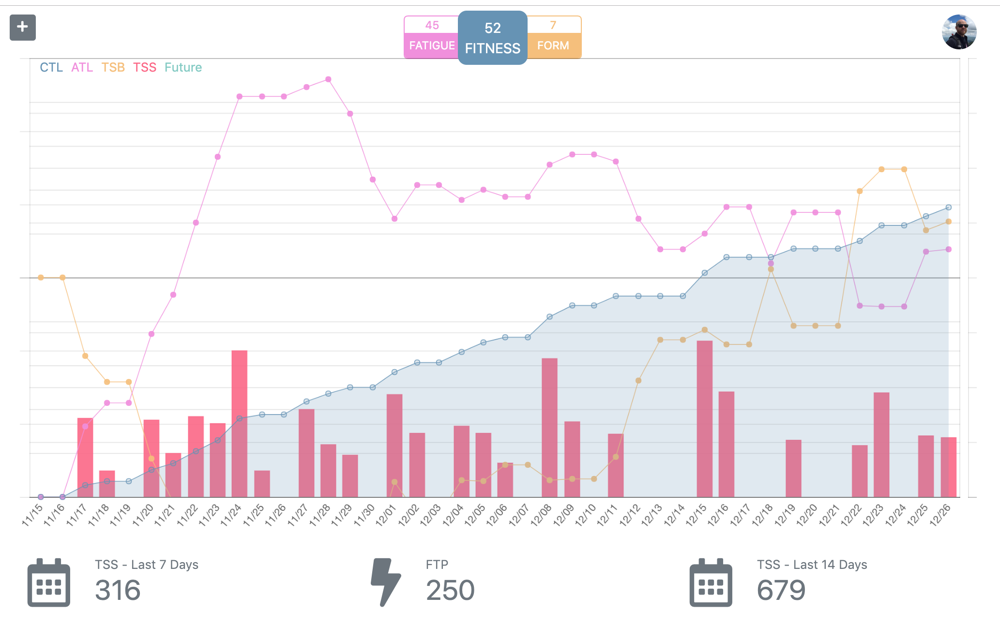
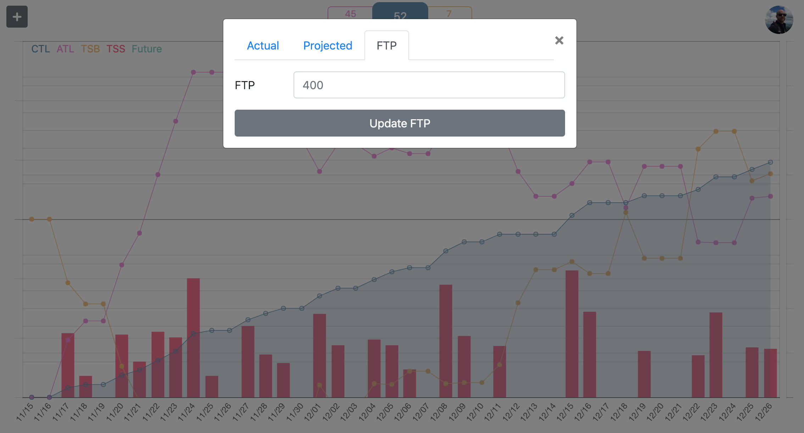
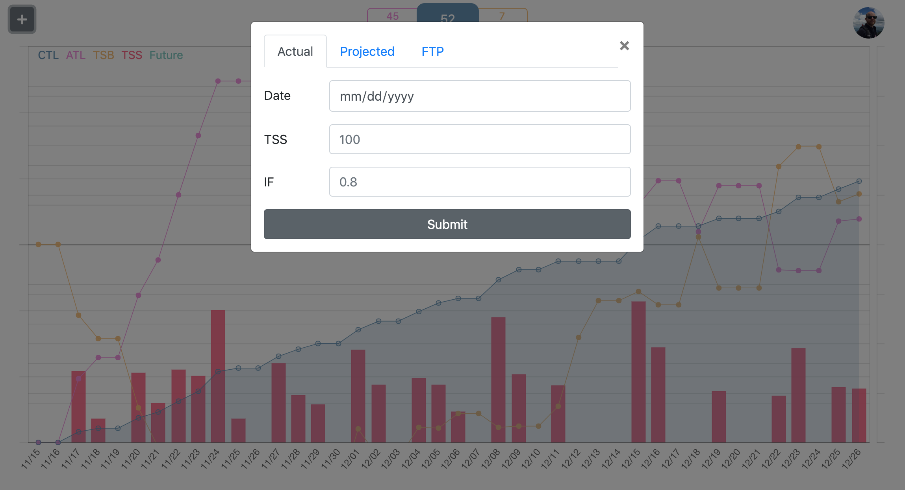
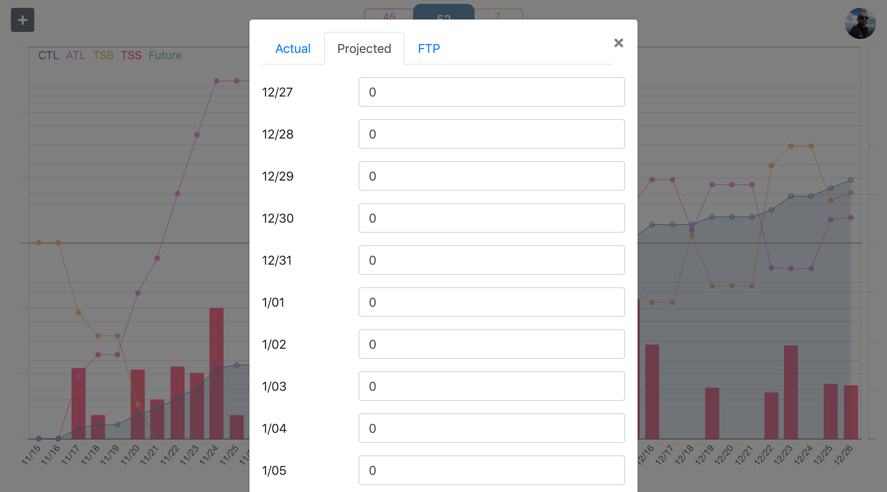

# Performance Management Chart Ripoff
My own personal PMC, modeled off of [Training Peaks Software](https://www.trainingpeaks.com/blog/what-is-the-performance-management-chart/). I do personally have a paid Training Peaks account, that provides this same exact information, allowing an athlete to track their Training Stress Score, along with Chronic and Acute Training loads over time, and into the future. 

Training Peaks' software is way more advanced and much easier to use, but I wanted to see if I could build the same logic myself. 

Using charts.js, moment.js, Google Auth Login, and Google Firebase for Data Storage, I've created a basic application that would allow a user to input their Training Stress Score and Intenisty Factor for a given date, and track their fitness over time and even project their fitness by adding workouts in the future.

Using the user's data I calculate the following:
* Fitness (CTL) is a rolling 42 day average of your daily TSS.
* Fatigue (ATL) is a 7 day average of your TSS that accounts for the workouts you have done recently.
* Form (TSB) is the balance of TSS equal to yesterday's fitness minus yesterday's fatigue.

## Login Screen

## User's PMC

## FTP - Update

## TSS Current/Past - Add

## TSS Future - Add

